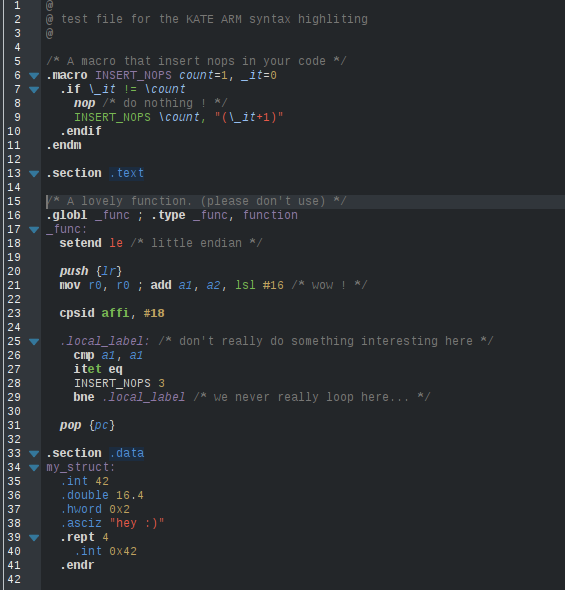
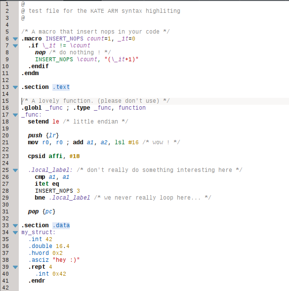
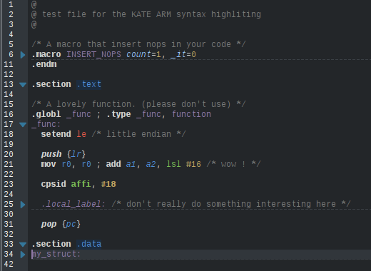

# Kate ARM syntax highlighting

Currently support _gas_ ARM assembly for **ARM1176JZF-S**.

**HOW TO USE:** copy the `asm-arm.xml` file in the `katepart/syntax` folder

### Features:
  - a lot of different configurable entries (instruction, pseudo instructions, core registers, core register aliases, ...)
  - gas `.macro` directive highlight
  - code folding by `.section`, `.macro` and code indentation (a bit like python)
  - contextualized auto-completion (instructions and directive for the first word, registers and other for operands (including some special instructions that have special operands))
  - ...

### TODO:
  - some missing instructions (thumb is far from being complete -- there's no thumb 2)
  - only the divided syntax, not the unified. (but the highlighter syntax is a bit poor when it's time to add affixes and prefixes to keywords...)
  - and probably some other things

### Screenshot

when using a dark color scheme:

when using a light color scheme:

code folding:

